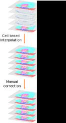

# Label cell types

## Overview


## 1. Manually label every N images.
Use a paint tool to label cell types. See the table below for the default color scheme.

<table>
<tr><th>name</th><th>R</th><th>G</th><th>B</th><th>A</th></tr>
<tr><td>background</td><td>0</td><td>0</td><td>0</td><td>0</td></tr>
<tr><td>type 1</td><td>255</td><td>0</td><td>255</td><td>255</td></tr>
<tr><td>type 2</td><td>255</td><td>240</td><td>0</td><td>255</td></tr>
<tr><td>type 3</td><td>255</td><td>0</td><td>0</td><td>255</td></tr>
<tr><td>type 4</td><td>0</td><td>12</td><td>255</td><td>255</td></tr>
<tr><td>type 5</td><td>0</td><td>156</td><td>209</td><td>255</td></tr>
<tr><td>type 6</td><td>18</td><td>255</td><td>0</td><td>255</td></tr>
<tr><td>type 7</td><td>227</td><td>255</td><td>0</td><td>255</td></tr>
</table>

## 2. Execute cell based label interpolation
- Input \<non_labeled\>: Non-labeled sectioned image.
- Input \<labeled1\>: Labeled image above  \<non_labeled\>.
- Input \<labeled2\>: Labeled image below  \<non_labeled\>.

```bash
assign_labels -i <non_labeled> -r <labeled1> <labeled2>
```
- Output: Interpolated labels.

## 3. Manually correct interpolated labels
Use a paint tool to correct interpolated labels.