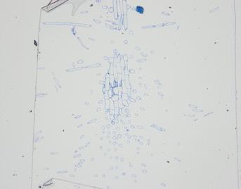
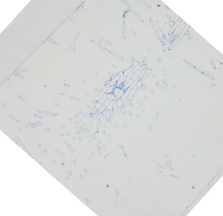
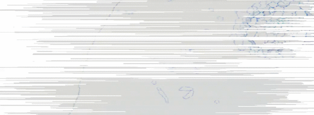
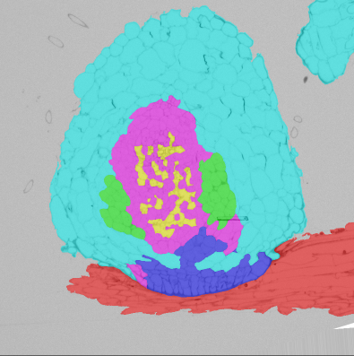
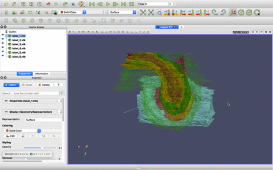

# Workflow

## 1. Image Registration (alignment)
Align sequence of section images.

<table>
<tr><th>Pre alignment - xy plane</th></tr>
<tr><td></td></tr>
</table>

<table>
<tr><th>Post alignment - xy plane</th><th>Post alignment - yz plane</th></tr>
<tr>
<td></td>
<td></td>
</tr>
</table>

## 2. Cell Labeling
Label cells in the aligned images. [Document](2_labeling.md).

## 3. Surface extraction and visualization
Converted labeled images into surface data and visualize them. [Document](3_visualization.md).

